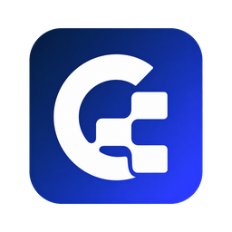

<p align="center">
  
</p>

<h1 align="center">Codeverta ERP</h1>

<p align="center">
  ERP modular untuk operasional perusahaan, dibangun dengan Go, React, dan arsitektur SaaS database-per-tenant.
</p>

<p align="center">
  <a href="https://github.com/codeverta/enterprise.codeverta.com/actions/workflows/ci.yml"></a>
  <a href="https://github.com/codeverta/enterprise.codeverta.com/stargazers"></a>
  <a href="https://github.com/codeverta/enterprise.codeverta.com/forks"></a>
  <a href="https://github.com/codeverta/enterprise.codeverta.com/issues"></a>
  <a href="https://github.com/codeverta/enterprise.codeverta.com/commits/main"></a>
  
  
</p>

<p align="center">
  <a href="https://docs.codeverta.com">Documentation</a>
  ·
  <a href="https://github.com/codeverta/enterprise.codeverta.com/issues">Report a bug</a>
  ·
  <a href="https://github.com/codeverta/enterprise.codeverta.com/issues">Request a feature</a>
</p>

---

## Tentang Codeverta ERP

Codeverta ERP adalah aplikasi enterprise terpadu untuk mengelola penjualan, pembelian, stok, akuntansi, manufaktur, CRM, HR, project, dan administrasi organisasi melalui satu antarmuka.

Backend menggunakan satu codebase Go dan frontend React yang sama untuk semua tenant. Dalam mode SaaS, setiap tenant memiliki database, user, transaksi, konfigurasi, dan namespace file sendiri.

> [!IMPORTANT]
> Mode database-per-tenant sudah memiliki fondasi isolasi request dan database, tetapi masih bersifat opt-in. Baca [batas implementasi dan checklist go-live](docs/erp/MULTI_TENANT_OPERATIONS.md#24-batas-implementasi-saat-ini) sebelum mengaktifkannya di production.

## Fitur utama

- **Selling** — customer, quotation, sales order, sales invoice, POS, pricing rule, dan loyalty.
- **Buying** — supplier, material request, purchase order, purchase invoice, dan penerimaan barang.
- **Stock** — item, warehouse, UOM, price list, item price, delivery note, dan stock entry.
- **Accounting** — chart of accounts, general ledger, journal entry, payment, tax, budget, dan financial report.
- **Manufacturing** — BOM, operation, workstation, work order, raw material, costing, dan quality inspection.
- **CRM** — lead, opportunity, customer, address, contact, dan customer group.
- **HR** — employee, attendance, leave, payroll, dan struktur organisasi.
- **Projects** — project, task, timesheet, dan pelacakan pekerjaan.
- **Platform** — user, role, permission, role profile, module profile, audit log, notification, dan impersonation.
- **Security** — JWT/refresh token, WebAuthn, login throttling, rate limit, request size limit, dan audit trail.
- **Realtime & integrations** — WebSocket notification, email, object storage, webhook, dan payment integration.
- **Desktop** — aplikasi native ringan untuk macOS, Windows, dan Linux melalui Tauri.

## Arsitektur

```text
                           Internet
                              │
                              ▼
                       DNS / TLS / HAProxy
                              │
                 ┌────────────┴────────────┐
                 ▼                         ▼
          React Admin UI             Go + Gin API
                                           │
                                  Tenant Resolver
                                           │
                 ┌─────────────────────────┼─────────────────────────┐
                 ▼                         ▼                         ▼
            platform_db               erp_alpha                  erp_beta
          tenant registry            tenant Alpha               tenant Beta
```

Prinsip SaaS yang dipakai:

```text
ONE APPLICATION · ONE CODEBASE · ONE DEPLOYMENT · ONE DATABASE PER TENANT
```

Detail desain tersedia di [Database-per-Tenant Architecture](docs/erp/DATABASE_PER_TENANT_ARCHITECTURE.md).

## Tech stack

| Area | Teknologi |
|---|---|
| Frontend | React 19, TypeScript, Vite 7, Tailwind CSS, Radix UI/shadcn, TanStack Table |
| Backend | Go 1.25, Gin, GORM |
| Database | MariaDB 11.8 / MySQL-compatible database |
| Cache & jobs | Redis |
| Reverse proxy | HAProxy |
| Desktop | Tauri 2 |
| Testing | Vitest, Testing Library, Go testing |
| Deployment | Docker Compose, multi-stage Docker images |

## Struktur repository

```text
.
├── apps/
│   ├── admin/                     # React admin dashboard dan Tauri app
│   └── backend/                   # Go API, CLI, model, controller, dan modules
│       ├── cmd/erp/               # Platform dan tenant CLI
│       ├── internal/tenancy/      # Resolver, context, pool, namespace
│       ├── internal/platform/     # Platform auth, provisioning, entitlement
│       └── modules/               # Vertical ERP modules
├── docs/                          # Dokumentasi teknis dan operasional
├── haproxy/                       # Shared HTTP routing
├── docker-compose.yml             # Deployment default/legacy
├── docker-compose.multitenant.yml # Overlay database-per-tenant
└── pnpm-workspace.yaml            # Monorepo workspace
```

## Getting started

### Prasyarat

Pilih salah satu metode berikut:

1. **Docker Compose — direkomendasikan untuk mencoba aplikasi**
   - Docker Engine atau Docker Desktop;
   - Docker Compose v2.

2. **Native development**
   - Node.js 24;
   - pnpm 11.3;
   - Go 1.25;
   - MariaDB/MySQL;
   - Redis.

### 1. Clone repository

```bash
git clone https://github.com/codeverta/enterprise.codeverta.com.git
cd enterprise.codeverta.com
```

### 2. Siapkan environment

```bash
cp .env.example .env
cp apps/backend/.env.example apps/backend/.env
cp apps/admin/.env.example apps/admin/.env
```

Untuk Docker Compose default, pastikan frontend menggunakan shared proxy:

```dotenv
# apps/admin/.env
VITE_BASE_API_URL=http://localhost
VITE_COS_CDN_BASE_URL=http://localhost
```

Ganti seluruh placeholder secret sebelum deployment di luar development. Minimal, buat `JWT_SECRET` sepanjang 64 karakter atau lebih:

```bash
openssl rand -base64 64
```

### 3A. Jalankan dengan Docker Compose

```bash
docker compose up -d --build
```

Periksa container:

```bash
docker compose ps
docker compose logs -f backend-go
```

Buka aplikasi di [http://localhost](http://localhost).

Untuk menghentikan aplikasi tanpa menghapus data:

```bash
docker compose down
```

> [!CAUTION]
> Jangan menambahkan `-v` pada `docker compose down` jika database masih diperlukan. Opsi tersebut menghapus volume data MariaDB.

### 3B. Jalankan untuk development

Pastikan MariaDB dan Redis lokal sudah aktif, lalu sesuaikan koneksi di `apps/backend/.env`:

```dotenv
SQL_DSN=codeverta:change-me@tcp(127.0.0.1:3306)/codeverta_erp?charset=utf8mb4&parseTime=True&loc=Local
REDIS_CONN_STRING=redis://127.0.0.1:6379/0
```

Install dependency:

```bash
corepack enable
corepack prepare pnpm@11.3.0 --activate
pnpm install --frozen-lockfile
```

Jalankan backend dan frontend pada terminal terpisah:

```bash
pnpm dev:backend
```

```bash
pnpm dev:admin
```

Alamat development:

- Admin UI: [http://localhost:5174](http://localhost:5174)
- Backend API: [http://localhost:8084](http://localhost:8084)

## Memulai mode SaaS database-per-tenant

Gunakan Compose overlay setelah semua secret multi-tenant diisi:

```bash
docker compose \
  -f docker-compose.yml \
  -f docker-compose.multitenant.yml \
  up -d --build
```

Buat administrator platform pertama:

```bash
docker compose \
  -f docker-compose.yml \
  -f docker-compose.multitenant.yml \
  exec backend-go ./erp platform create-admin \
  --email platform-admin@example.com \
  --password 'PASSWORD-ADMIN-PLATFORM'
```

Buat tenant pertama:

```bash
docker compose \
  -f docker-compose.yml \
  -f docker-compose.multitenant.yml \
  exec backend-go ./erp tenant create alpha \
  --name "PT Alpha" \
  --domain alpha.erp.example.com \
  --plan starter \
  --admin admin@alpha.example.com
```

CLI menghasilkan database, user database, schema ERP, dan admin awal tenant. Jika `--admin-password` tidak diberikan, password aman ditampilkan satu kali.

Panduan environment, `platform_db`, CLI/API, custom domain, migration, pool, keamanan, dan troubleshooting tersedia di [Multi-Tenant Operations Guide](docs/erp/MULTI_TENANT_OPERATIONS.md).

## Perintah development

| Perintah | Fungsi |
|---|---|
| `pnpm dev` | Menjalankan frontend dan backend secara paralel |
| `pnpm dev:admin` | Menjalankan Vite admin UI |
| `pnpm dev:backend` | Menjalankan Go API |
| `pnpm build` | Build admin web |
| `pnpm --filter admin-page test` | Menjalankan test frontend |
| `pnpm --filter admin-page lint` | Menjalankan lint frontend |
| `pnpm dev:desktop` | Menjalankan aplikasi desktop development |
| `pnpm build:desktop` | Build binary desktop pada OS aktif |

### Test frontend terarah

```bash
pnpm --filter admin-page test -- src/modules/selling/pages/SalesOrderPage.test.tsx
```

### Test backend terarah

```bash
cd apps/backend
JWT_SECRET=dummy_secret_for_test_12345678901234567890123456789012345678901234567890 \
go test -v ./internal/tenancy
```

CI menjalankan build frontend, verifikasi Go module, seluruh Go test, dan build backend pada setiap push/pull request ke `main` dan `develop`.

## Desktop application

Dashboard React yang sama tersedia sebagai aplikasi Tauri:

```bash
pnpm dev:desktop
pnpm build:desktop
```

Paket distribusi harus dibuat pada OS target:

```bash
pnpm build:desktop:macos
pnpm build:desktop:windows
pnpm build:desktop:linux
```

Baca [Desktop/Tauri Guide](docs/TAURI_DESKTOP.md) untuk konfigurasi API, signing, dan packaging.

## Dokumentasi

| Dokumen | Isi |
|---|---|
| [Documentation website](https://docs.codeverta.com) | Panduan penggunaan ERP |
| [Multi-Tenant Operations](docs/erp/MULTI_TENANT_OPERATIONS.md) | Instalasi SaaS, tenant CLI/API, domain, migration, dan troubleshooting |
| [Database-per-Tenant Architecture](docs/erp/DATABASE_PER_TENANT_ARCHITECTURE.md) | Keputusan arsitektur, isolation, security, dan scaling |
| [Core Extraction](docs/CORE_EXTRACTION.md) | Boundary core ERP dan aturan ekstensi |
| [DocType Lifecycle](docs/DOCTYPE_LIFECYCLE.md) | Lifecycle metadata DocType |
| [Desktop/Tauri](docs/TAURI_DESKTOP.md) | Development dan release aplikasi desktop |

## Contributing

Kontribusi melalui issue dan pull request dipersilakan sesuai kebijakan repository:

1. buat issue atau pilih issue yang tersedia;
2. fork repository dan buat branch terpisah;
3. pertahankan boundary module dan tenant isolation;
4. tambahkan test terarah untuk perubahan;
5. jalankan lint/build/test yang relevan;
6. buka pull request dengan penjelasan masalah, solusi, dan cara verifikasi.

Untuk perubahan backend, hindari global database connection pada business query. Database harus berasal dari tenant request/job context.

## Security

Jangan melaporkan credential, token, atau data customer di public issue. Hindari menyalakan endpoint/job legacy dalam strict tenant mode sebelum alur tersebut mempunyai tenant mapping yang dapat diverifikasi.

Prinsip keamanan utama:

- tenant dipilih dari hostname yang terdaftar dan terverifikasi;
- tenant ID pada JWT harus sama dengan tenant hostname;
- password database tenant dienkripsi;
- cache, file, job, dan WebSocket wajib memiliki namespace tenant;
- platform admin terpisah dari user ERP tenant;
- query ERP tidak boleh fallback ke `platform_db`.

## License

Repository ini belum memiliki file `LICENSE`. Sampai lisensi resmi ditambahkan, hak penggunaan, modifikasi, dan distribusi tidak boleh diasumsikan sebagai lisensi open-source.

---

<p align="center">
  Built by <a href="https://codeverta.com">Codeverta</a>
</p>
