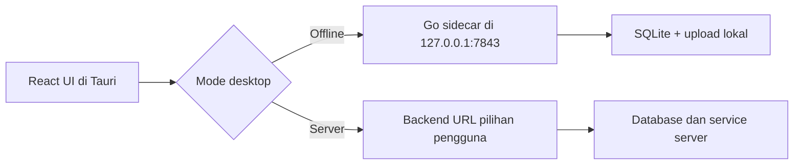

# Codeverta ERP Desktop: Offline dan Server

Codeverta ERP Desktop menggunakan Tauri 2. Installer desktop membundel frontend React, native shell, dan backend Go sebagai sidecar. Pengguna tidak perlu mengunduh atau memasang MySQL, Redis, Node.js, Go, maupun backend secara terpisah.

## Alur pertama kali dibuka

Saat aplikasi desktop belum memiliki konfigurasi, onboarding akan meminta:

1. Bahasa aplikasi: Bahasa Indonesia atau English.
2. Mata uang utama.
3. Nama workspace/perusahaan.
4. Mode penyimpanan data.
5. Nama dan password administrator lokal untuk mode offline.

Setelah administrator berhasil dibuat, bootstrap instalasi menjalankan pipeline seeder satu kali. Pipeline memasang role bawaan, template email, struktur organisasi, kategori dan paket awal, UOM, warehouse, Stock Entry Type, serta katalog Print Format. Statusnya disimpan di `installation_seed_states`, sehingga proses yang terputus dapat dilanjutkan dan startup berikutnya tidak membuat data duplikat.

Katalog Printing berisi 35 Print Format awal. Seeder hanya menambahkan data yang belum ada dan tidak menimpa format yang sudah disesuaikan pengguna.

### Mandiri & Offline

- Backend lokal dimulai otomatis bersama aplikasi.
- Database menggunakan SQLite di folder data aplikasi milik sistem operasi.
- Upload lokal disimpan di folder data aplikasi.
- Service hanya mendengarkan `127.0.0.1:7843`, sehingga database tidak diekspos ke jaringan lokal.
- Redis, worker email, payment gateway, dan worker jaringan tidak dimulai.
- Secret lokal dibuat otomatis saat onboarding dan konfigurasi diberi permission terbatas pada sistem Unix.
- Setelah setup selesai, pengguna login dengan identifier `admin` dan password yang dibuat pada onboarding.

Mode ini dapat digunakan tanpa koneksi internet untuk pekerjaan ERP lokal seperti master data, pembelian, penjualan, stok, organisasi, dan pencatatan lain yang tidak bergantung pada layanan pihak ketiga.

Fitur yang secara alami memerlukan internet tetap tidak tersedia saat perangkat offline, misalnya email cloud, payment gateway, OAuth, AI/cloud API, object storage remote, dan sinkronisasi antarperangkat. Data offline tidak otomatis tersinkron ke server; sinkronisasi dua arah perlu dibangun sebagai fitur terpisah jika dibutuhkan.

### Terhubung ke Server

- Pengguna memasukkan base URL backend, misalnya `https://erp-api.example.com`.
- Onboarding memeriksa endpoint `/health` sebelum menyimpan konfigurasi.
- Akun, database, upload, dan integrasi mengikuti server tersebut.
- Koneksi ke server diperlukan agar aplikasi berfungsi.

## Arsitektur



File penting:

| File | Fungsi |
| --- | --- |
| `apps/admin/src/components/DesktopSetup.tsx` | UI onboarding dan bootstrap desktop |
| `apps/admin/src/lib/desktop-runtime.ts` | Cache konfigurasi dan pemilihan API runtime |
| `apps/admin/src-tauri/src/lib.rs` | Penyimpanan konfigurasi dan lifecycle sidecar |
| `apps/admin/scripts/build-desktop-sidecar.mjs` | Build backend Go sesuai target desktop |
| `apps/admin/src-tauri/tauri.conf.json` | Konfigurasi bundle dan external binary |
| `apps/backend/model/main.go` | Pemilihan MySQL atau SQLite |

## Lokasi data pengguna

Nama folder tepat mengikuti aturan `appDataDir` dan `appConfigDir` Tauri pada masing-masing OS. File utamanya adalah:

- `desktop-config.json` di folder konfigurasi aplikasi.
- `codeverta-offline.db` di folder data aplikasi.
- `uploads/` di folder data aplikasi.

Database tidak ditempatkan di dalam `.app`, `.exe`, atau folder installer agar data tetap ada ketika aplikasi diperbarui.

Sebelum uninstall atau pindah perangkat, backup file database dan folder upload. Jangan menjalankan dua instance aplikasi dengan database yang sama melalui network drive.

## Debug login dan pemulihan password offline

Pada mode offline, nama administrator yang dimasukkan saat onboarding adalah **nama tampilan**, bukan username. Identifier bawaan administrator lokal adalah:

```text
username: admin
email: admin@codeverta.com
```

Password onboarding hanya dipakai ketika tabel user masih kosong. Mengulang onboarding atau mengganti nama workspace tidak me-reset password pada database yang sudah ada.

Utility maintenance dapat dijalankan dari root repository. Utility ini tidak pernah menampilkan password hash dan meminta password secara tersembunyi di terminal.

Cari lokasi database:

```bash
pnpm desktop:data locate
```

Periksa integritas database, username, email, status, dan role:

```bash
pnpm desktop:data inspect --database "/path/to/codeverta-offline.db"
```

Status user aktif adalah `1`. Periksa apakah password yang diingat cocok tanpa mengubah data:

```bash
pnpm desktop:data verify-password \
  --database "/path/to/codeverta-offline.db" \
  --identifier admin
```

Jika password tidak cocok, tutup Codeverta Desktop sepenuhnya lalu reset:

```bash
pnpm desktop:data reset-password \
  --database "/path/to/codeverta-offline.db" \
  --identifier admin
```

Password baru harus 8–72 karakter. Reset juga mengganti token user sehingga sesi login lama tidak dapat digunakan kembali. Jika hasil `inspect` menunjukkan status selain `1` dan akun memang harus diaktifkan kembali, tambahkan flag `--enable` secara eksplisit.

```bash
pnpm desktop:data reset-password \
  --database "/path/to/codeverta-offline.db" \
  --identifier admin \
  --enable
```

Utility menolak reset, backup, dan restore selama API desktop masih hidup di `127.0.0.1:7843`. Ini mencegah database berubah ketika sidecar masih menulis data.

## Backup dan restore database offline

Tutup Codeverta Desktop sepenuhnya sebelum melakukan operasi data.

Backup database:

```bash
pnpm desktop:data backup \
  --database "/path/to/codeverta-offline.db" \
  --output "/path/to/backup/codeverta-offline-2026-09-13.db"
```

Backup diverifikasi dengan SQLite `integrity_check` dan wajib memiliki tabel Codeverta `users`. Utility juga membuat file `<nama-backup>.sha256`. Simpan file checksum bersama backup; restore memverifikasinya dan menolak backup yang berubah. Backup lama tanpa checksum tetap dapat dipulihkan untuk backward compatibility setelah lolos pemeriksaan integritas SQLite.

Untuk backup perangkat yang lengkap, salin juga:

```text
desktop-config.json
uploads/
```

Restore atau import database:

```bash
pnpm desktop:data restore \
  --database "/path/to/codeverta-offline.db" \
  --input "/path/to/backup/codeverta-offline-2026-09-13.db" \
  --confirm
```

Alias `import` juga tersedia. Sebelum mengganti database, utility otomatis membuat salinan:

```text
codeverta-offline.db.before-restore-YYYYMMDD-HHMMSS
```

Jika backup berasal dari perangkat lain, pindahkan `desktop-config.json` bersama database karena file tersebut menyimpan key lokal yang diperlukan untuk membaca field terenkripsi. File konfigurasi mengandung secret lokal; simpan dengan permission privat dan jangan unggah ke issue, chat, atau repository.

Lokasi default:

| OS | Data aplikasi |
| --- | --- |
| macOS | `~/Library/Application Support/com.codeverta.erp/` |
| Windows | `%APPDATA%\\com.codeverta.erp\\` |
| Linux | `$XDG_DATA_HOME/com.codeverta.erp/` atau `~/.local/share/com.codeverta.erp/` |

Urutan pemulihan yang aman:

1. tutup Codeverta Desktop;
2. jalankan `locate` dan `inspect`;
3. buat backup database aktif;
4. validasi file yang akan di-import;
5. jalankan `restore --confirm`;
6. bila berpindah perangkat, pulihkan folder upload dan konfigurasi yang sesuai;
7. buka aplikasi, login memakai `admin`, lalu periksa data penting.

## Development

Prasyarat umum:

- Node.js dan pnpm.
- Rust toolchain dan dependency Tauri untuk OS target.
- Go.
- C compiler yang dapat dipakai CGO, karena driver SQLite backend menggunakan `go-sqlite3`.

Jalankan desktop development dari root repository:

```bash
pnpm dev:desktop
```

`beforeDevCommand` otomatis membangun sidecar sesuai target triple host, lalu menjalankan Vite pada `http://127.0.0.1:5174`.

Frontend web biasa tetap memakai `VITE_BASE_API_URL` dan tidak menampilkan onboarding desktop. Pemilihan API runtime hanya aktif di dalam Tauri.

## Build dan installer

Build harus dilakukan pada OS target: `.dmg`/`.app` di macOS dan `.exe` NSIS di Windows.

Build binary tanpa installer:

```bash
pnpm build:desktop
```

Build macOS:

```bash
pnpm build:desktop:macos
```

Build Windows:

```bash
pnpm build:desktop:windows
```

Sebelum setiap Tauri build, script `build:desktop-sidecar` menghasilkan:

```text
apps/admin/src-tauri/binaries/codeverta-backend-<target-triple>[.exe]
```

Folder binary tersebut di-ignore dari Git karena merupakan artefak build. Tauri memasukkannya ke bundle melalui `bundle.externalBin`.

Installer hasil build sudah membawa seluruh runtime aplikasi. Koneksi internet tidak diperlukan untuk menjalankan mode offline setelah aplikasi dan WebView bawaan OS tersedia. Untuk distribusi publik, signing dan notarization tetap direkomendasikan agar installer dipercaya oleh macOS/Windows.

## Update otomatis aplikasi desktop

Codeverta Desktop memeriksa update beberapa detik setelah antarmuka siap. Pemeriksaan tidak menahan startup, tidak berjalan di browser web, dan kegagalan jaringan saat perangkat offline hanya dicatat ke console. Jika versi baru tersedia, pengguna memperoleh dialog berisi:

- versi yang sedang terpasang dan versi terbaru;
- tanggal rilis;
- catatan perubahan lengkap dari GitHub Release;
- pilihan **Nanti** atau **Update sekarang**;
- progres unduhan dalam persen dan byte;
- status pemasangan dan restart;
- pesan aman serta tombol mencoba ulang ketika update gagal.

Pilihan **Nanti** berlaku selama sesi aplikasi saat ini. Update akan ditawarkan kembali setelah aplikasi dibuka ulang. Paket tidak akan dipasang bila signature Ed25519-nya tidak cocok dengan public key yang dibundel di aplikasi.

### Perlindungan database selama update

Ketika pengguna memilih **Update sekarang**, shell desktop membuat marker update pada folder data aplikasi. Pada startup sidecar versi baru, sebelum `AutoMigrate` atau seeder menyentuh SQLite, recovery manager akan:

1. mendeteksi migrasi yang sebelumnya terputus dan memulihkan snapshotnya terlebih dahulu;
2. menjalankan WAL checkpoint dan `PRAGMA integrity_check`;
3. membuat snapshot database dengan permission privat;
4. menyimpan SHA-256 snapshot dalam journal eksternal;
5. menjalankan migrasi schema dan data;
6. memeriksa integritas database setelah migrasi;
7. mencatat schema version ke `desktop_schema_migrations`;
8. menghapus journal hanya setelah seluruh initialization berhasil.

Jika migrasi atau seeder gagal, koneksi database ditutup dan snapshot dikembalikan secara otomatis. Jika proses mati atau perangkat kehilangan daya, journal tetap berada di luar database dan recovery dijalankan pada startup berikutnya sebelum migrasi dicoba lagi.

Snapshot disimpan di:

```text
<app-data>/recovery-backups/
```

Secara default lima snapshot terbaru dipertahankan. Jumlahnya dapat diubah pada sidecar environment:

```dotenv
DESKTOP_BACKUP_RETENTION=5
```

Schema database mempunyai versi tersendiri dan tidak mengikuti nomor versi UI. Jika sebuah release mengubah struktur atau melakukan transformasi data persisted, naikkan `CurrentSchemaVersion` di:

```text
apps/backend/internal/desktoprecovery/manager.go
```

Jangan menaikkan schema version untuk perubahan UI saja. Migration function harus tetap idempotent karena akan dicoba ulang setelah rollback.

### Recovery center

Jika backend lokal tidak dapat dimulai tetapi snapshot tersedia, layar **Workspace belum dapat dimulai** menampilkan Recovery Database. User dapat memilih snapshot berdasarkan tanggal dan ukuran lalu menekan **Pulihkan snapshot**.

Recovery center:

- hanya aktif untuk mode offline;
- hanya menerima nama file `.db` dari folder recovery internal dan menolak path traversal;
- memeriksa header SQLite sebelum mengganti database;
- membuat `manual-before-restore-*.db` dari database aktif;
- menggunakan temporary file dan atomic rename;
- menghapus WAL/SHM lama;
- memulai sidecar kembali dan menjalankan integrity/migration checks;
- menyimpan audit ringkas di `desktop-last-recovery.json`.

Jika automatic crash recovery pernah berjalan, aplikasi menampilkan notifikasi satu kali setelah workspace kembali sehat.

Alur production:

```text
tag Git v0.0.2
       ↓
GitHub Actions build empat target OS
       ↓
sign installer + updater artifact
       ↓
GitHub Release + latest.json + *.sig
       ↓
aplikasi memeriksa latest.json
       ↓
verifikasi signature → download → install → restart
```

### 1. Buat signing key updater

Lakukan sekali pada komputer release yang aman:

```bash
pnpm --filter admin-page exec tauri signer generate -w ~/.tauri/codeverta-updater.key
```

CLI meminta password dan menampilkan public key. Simpan private key serta password di password manager/secret manager. Jangan commit private key, jangan memasukkannya ke file `.env`, dan jangan mengirimkannya melalui issue atau chat.

Ganti placeholder berikut di `apps/admin/src-tauri/tauri.conf.json` dengan public key yang dihasilkan:

```json
"pubkey": "REPLACE_WITH_TAURI_UPDATER_PUBLIC_KEY"
```

Public key aman berada di repository. Aplikasi lama harus tetap memakai public key yang sesuai dengan private key yang menandatangani semua rilis berikutnya. Rotasi key perlu direncanakan melalui rilis transisi; kehilangan private key berarti instalasi lama tidak dapat menerima update yang ditandatangani key baru.

### 2. Tambahkan GitHub Actions secrets

Di repository GitHub buka **Settings → Secrets and variables → Actions**, lalu tambahkan:

| Secret | Isi |
| --- | --- |
| `TAURI_SIGNING_PRIVATE_KEY` | Seluruh isi file `~/.tauri/codeverta-updater.key` |
| `TAURI_SIGNING_PRIVATE_KEY_PASSWORD` | Password key saat dibuat |

`GITHUB_TOKEN` disediakan otomatis oleh GitHub Actions. Workflow hanya menggunakan private key saat job berjalan dan tidak mengunggahnya sebagai artifact.

> [!IMPORTANT]
> Secret signing updater berbeda dari certificate code signing Apple/Windows. Untuk menghilangkan warning Gatekeeper/SmartScreen pada distribusi publik, tambahkan Apple Developer signing/notarization dan Windows code-signing certificate secara terpisah.

### 3. Buat rilis baru

Versi harus lebih tinggi daripada aplikasi yang sudah terpasang dan harus sama di `package.json`, `tauri.conf.json`, `Cargo.toml`, serta `Cargo.lock`. Gunakan helper agar semuanya konsisten:

```bash
pnpm desktop:version 0.0.2
git add apps/admin/package.json apps/admin/src-tauri/tauri.conf.json \
  apps/admin/src-tauri/Cargo.toml apps/admin/src-tauri/Cargo.lock
git commit -m "release: desktop v0.0.2"
git tag v0.0.2
git push origin main v0.0.2
```

Push tag `v*` memulai `.github/workflows/desktop-build.yml`. Workflow menolak rilis bila tag dan versi file tidak sama atau signing secret belum tersedia. Target yang dibangun:

| Target | Runner | Paket utama |
| --- | --- | --- |
| macOS Apple Silicon | `macos-15` | `.app`, `.dmg`, updater tarball |
| macOS Intel | `macos-15-intel` | `.app`, `.dmg`, updater tarball |
| Windows x64 | `windows-latest` | NSIS `.exe`, updater bundle |
| Linux x64 | `ubuntu-22.04` | `.deb`, AppImage, updater bundle |

Workflow mengambil generated release notes dari GitHub, kemudian `tauri-action` membuat GitHub Release publik, upload installer, signature `.sig`, dan `latest.json`. Endpoint aplikasi adalah:

```text
https://github.com/codeverta/enterprise.codeverta.com/releases/latest/download/latest.json
```

Workflow juga dapat dijalankan manual dari tab **Actions** dengan memasukkan tag yang sudah sesuai dengan versi source.

### 4. Uji updater sebelum rilis umum

Update hanya dapat diuji dari binary dengan versi lebih rendah. Contoh yang benar:

1. install build production `0.0.1` yang memakai public key production;
2. naikkan source menjadi `0.0.2` dan publish tag `v0.0.2`;
3. buka kembali aplikasi `0.0.1` dengan internet aktif;
4. pastikan dialog menampilkan versi dan release notes yang benar;
5. pilih **Update sekarang**, amati progres, kemudian pastikan aplikasi kembali sebagai `0.0.2`;
6. ulangi pada tiap OS dan pastikan database offline serta folder upload tetap ada.

Untuk memeriksa metadata tanpa memasangnya:

```bash
curl -fsSL https://github.com/codeverta/enterprise.codeverta.com/releases/latest/download/latest.json
```

Pastikan platform, architecture, URL artifact, dan signature tersedia. Rilis draft atau prerelease tidak menjadi endpoint `releases/latest`; workflow updater karena itu membuat rilis stabil yang langsung dipublikasikan.

### Edge case dan perilaku yang diharapkan

| Kondisi | Perilaku |
| --- | --- |
| Tidak ada internet saat startup | Aplikasi tetap terbuka dan mode offline tetap dapat dipakai; pemeriksaan update berhenti setelah timeout. |
| Server GitHub lambat/tidak tersedia | Tidak menghambat login; pengguna dapat mencoba lagi pada pemeriksaan berikutnya. |
| Tidak ada update | Tidak ada popup pada pemeriksaan otomatis. |
| Klik **Nanti** | Dialog ditutup untuk sesi berjalan dan muncul kembali setelah aplikasi dibuka ulang. |
| Unduhan putus | Dialog menampilkan kegagalan dan tombol **Coba lagi**; versi lama tetap dapat dipakai. |
| Signature salah/rusak | Instalasi dibatalkan sebelum paket diterapkan. Jangan mengarahkan pengguna untuk melewati verifikasi. |
| Migrasi schema gagal | Koneksi ditutup dan snapshot sebelum migrasi dikembalikan otomatis. |
| Listrik mati saat migrasi | Journal eksternal memicu restore snapshot pada startup berikutnya. |
| Snapshot dimodifikasi | Restore otomatis ditolak karena SHA-256 tidak cocok. |
| Backend tetap gagal setelah rollback | Recovery center menawarkan snapshot lain tanpa memerlukan terminal. |
| `latest.json` tidak memiliki target OS/CPU | Ditampilkan sebagai update yang belum tersedia untuk perangkat tersebut; periksa matrix dan asset rilis. |
| Disk penuh/permission ditolak | Update gagal dengan pesan ramah; kosongkan ruang atau perbaiki izin lalu coba lagi. |
| Aplikasi ditutup saat download | Versi aktif tidak berubah; pemeriksaan dimulai lagi pada launch berikutnya. |
| Aplikasi ditutup saat installer OS berjalan | Ikuti mekanisme atomic installer OS; validasi aplikasi pada startup selanjutnya. |
| Banyak klik pada tombol update | Service menggabungkan operasi yang sedang berjalan sehingga tidak membuat download paralel. |
| Web/Vite biasa | Komponen updater tidak dipasang dan plugin native tidak dipanggil. |
| Data offline | Berada di app data directory, bukan bundle aplikasi, sehingga tidak ditimpa updater. Tetap lakukan backup sebelum rilis besar. |
| Downgrade | Ditolak oleh default updater; lakukan rollback sebagai rilis dengan nomor versi yang lebih tinggi. |

### Diagnostik

Log frontend memakai prefix `[desktop-updater]` pada developer console dan tidak pernah mencetak private key. Jika update tidak muncul:

1. pastikan aplikasi benar-benar berjalan di Tauri, bukan tab browser;
2. bandingkan versi terpasang dengan field `version` di `latest.json`;
3. pastikan OS dan CPU memiliki entry di `platforms`;
4. buka URL artifact dari `latest.json` dan pastikan bukan asset draft/private yang tidak dapat diakses;
5. pastikan public key aplikasi cocok dengan private key GitHub Actions;
6. pastikan endpoint HTTPS dapat diakses oleh firewall perangkat;
7. periksa asset signature `.sig` pada GitHub Release.

Kode updater dipisahkan agar dapat dirawat dan diuji:

| File | Tanggung jawab |
| --- | --- |
| `apps/admin/src/services/updater.ts` | API Tauri, timeout, download/install, progress, restart, dan normalisasi error |
| `apps/admin/src/hooks/useUpdater.ts` | Lifecycle pemeriksaan background dan state UI |
| `apps/admin/src/components/DesktopUpdater.tsx` | Integrasi global shell desktop |
| `apps/admin/src/components/UpdateDialog.tsx` | Notifikasi versi dan release notes |
| `apps/admin/src/components/UpdateProgress.tsx` | Progres download/install/restart |
| `apps/backend/internal/desktoprecovery/manager.go` | Snapshot, journal, checksum, schema ledger, rollback, retention |
| `apps/admin/src/components/DesktopSetup.tsx` | Recovery center dan notifikasi hasil recovery |
| `.github/workflows/desktop-build.yml` | Build, signing, release, signature, dan `latest.json` |

## Checklist rilis

- Jalankan build frontend.
- Jalankan test backend yang terkait SQLite dan modul ERP.
- Jalankan `cargo check`.
- Jalankan `tauri build --no-bundle` sebagai smoke test release.
- Uji instalasi bersih tanpa koneksi internet.
- Selesaikan onboarding mode offline dan login sebagai `admin`.
- Tutup dan buka ulang aplikasi untuk memastikan sidecar dan data kembali tersedia.
- Uji backup/restore database dan folder upload.
- Uji rollback migrasi, recovery setelah simulated crash, checksum yang rusak, dan recovery center.
- Uji mode server dengan URL staging.
- Uji update dari satu versi lebih rendah pada seluruh target OS.
- Pastikan `latest.json` dan semua signature dapat diakses dari GitHub Release.
- Sign/notarize installer produksi.

## Catatan keamanan dan operasional

- Password administrator tidak disimpan di file konfigurasi desktop; hanya hash hasil backend yang berada di SQLite.
- Secret lokal tidak dikirim ke server mode online.
- Jangan memasukkan secret privat ke variable `VITE_*`, karena nilainya dibundel ke JavaScript.
- Mode offline ditujukan untuk satu perangkat. Untuk kolaborasi banyak perangkat, pilih mode server.
- Update aplikasi sebaiknya tidak menghapus folder data aplikasi.
