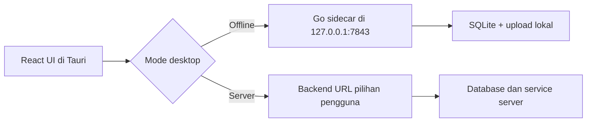

# Codeverta ERP Desktop: Offline dan Server

Codeverta ERP Desktop menggunakan Tauri 2. Installer desktop membundel frontend React, native shell, dan backend Go sebagai sidecar. Pengguna tidak perlu mengunduh atau memasang MySQL, Redis, Node.js, Go, maupun backend secara terpisah.

## Alur pertama kali dibuka

Saat aplikasi desktop belum memiliki konfigurasi, onboarding akan meminta:

1. Bahasa aplikasi: Bahasa Indonesia atau English.
2. Mata uang utama.
3. Nama workspace/perusahaan.
4. Mode penyimpanan data.
5. Nama dan password administrator lokal untuk mode offline.

Setelah administrator berhasil dibuat, bootstrap instalasi menjalankan pipeline seeder satu kali. Pipeline memasang role bawaan, template email, struktur organisasi, kategori dan paket awal, UOM, warehouse, Stock Entry Type, serta katalog Print Format. Statusnya disimpan di `installation_seed_states`, sehingga proses yang terputus dapat dilanjutkan dan startup berikutnya tidak membuat data duplikat.

Katalog Printing berisi 35 Print Format awal. Seeder hanya menambahkan data yang belum ada dan tidak menimpa format yang sudah disesuaikan pengguna.

### Mandiri & Offline

- Backend lokal dimulai otomatis bersama aplikasi.
- Database menggunakan SQLite di folder data aplikasi milik sistem operasi.
- Upload lokal disimpan di folder data aplikasi.
- Service hanya mendengarkan `127.0.0.1:7843`, sehingga database tidak diekspos ke jaringan lokal.
- Redis, worker email, payment gateway, dan worker jaringan tidak dimulai.
- Secret lokal dibuat otomatis saat onboarding dan konfigurasi diberi permission terbatas pada sistem Unix.
- Setelah setup selesai, pengguna login dengan identifier `admin` dan password yang dibuat pada onboarding.

Mode ini dapat digunakan tanpa koneksi internet untuk pekerjaan ERP lokal seperti master data, pembelian, penjualan, stok, organisasi, dan pencatatan lain yang tidak bergantung pada layanan pihak ketiga.

Fitur yang secara alami memerlukan internet tetap tidak tersedia saat perangkat offline, misalnya email cloud, payment gateway, OAuth, AI/cloud API, object storage remote, dan sinkronisasi antarperangkat. Data offline tidak otomatis tersinkron ke server; sinkronisasi dua arah perlu dibangun sebagai fitur terpisah jika dibutuhkan.

### Terhubung ke Server

- Pengguna memasukkan base URL backend, misalnya `https://erp-api.example.com`.
- Onboarding memeriksa endpoint `/health` sebelum menyimpan konfigurasi.
- Akun, database, upload, dan integrasi mengikuti server tersebut.
- Koneksi ke server diperlukan agar aplikasi berfungsi.

## Arsitektur



File penting:

| File | Fungsi |
| --- | --- |
| `apps/admin/src/components/DesktopSetup.tsx` | UI onboarding dan bootstrap desktop |
| `apps/admin/src/lib/desktop-runtime.ts` | Cache konfigurasi dan pemilihan API runtime |
| `apps/admin/src-tauri/src/lib.rs` | Penyimpanan konfigurasi dan lifecycle sidecar |
| `apps/admin/scripts/build-desktop-sidecar.mjs` | Build backend Go sesuai target desktop |
| `apps/admin/src-tauri/tauri.conf.json` | Konfigurasi bundle dan external binary |
| `apps/backend/model/main.go` | Pemilihan MySQL atau SQLite |

## Lokasi data pengguna

Nama folder tepat mengikuti aturan `appDataDir` dan `appConfigDir` Tauri pada masing-masing OS. File utamanya adalah:

- `desktop-config.json` di folder konfigurasi aplikasi.
- `codeverta-offline.db` di folder data aplikasi.
- `uploads/` di folder data aplikasi.

Database tidak ditempatkan di dalam `.app`, `.exe`, atau folder installer agar data tetap ada ketika aplikasi diperbarui.

Sebelum uninstall atau pindah perangkat, backup file database dan folder upload. Jangan menjalankan dua instance aplikasi dengan database yang sama melalui network drive.

## Development

Prasyarat umum:

- Node.js dan pnpm.
- Rust toolchain dan dependency Tauri untuk OS target.
- Go.
- C compiler yang dapat dipakai CGO, karena driver SQLite backend menggunakan `go-sqlite3`.

Jalankan desktop development dari root repository:

```bash
pnpm dev:desktop
```

`beforeDevCommand` otomatis membangun sidecar sesuai target triple host, lalu menjalankan Vite pada `http://127.0.0.1:5174`.

Frontend web biasa tetap memakai `VITE_BASE_API_URL` dan tidak menampilkan onboarding desktop. Pemilihan API runtime hanya aktif di dalam Tauri.

## Build dan installer

Build harus dilakukan pada OS target: `.dmg`/`.app` di macOS dan `.exe` NSIS di Windows.

Build binary tanpa installer:

```bash
pnpm build:desktop
```

Build macOS:

```bash
pnpm build:desktop:macos
```

Build Windows:

```bash
pnpm build:desktop:windows
```

Sebelum setiap Tauri build, script `build:desktop-sidecar` menghasilkan:

```text
apps/admin/src-tauri/binaries/codeverta-backend-<target-triple>[.exe]
```

Folder binary tersebut di-ignore dari Git karena merupakan artefak build. Tauri memasukkannya ke bundle melalui `bundle.externalBin`.

Installer hasil build sudah membawa seluruh runtime aplikasi. Koneksi internet tidak diperlukan untuk menjalankan mode offline setelah aplikasi dan WebView bawaan OS tersedia. Untuk distribusi publik, signing dan notarization tetap direkomendasikan agar installer dipercaya oleh macOS/Windows.

## Checklist rilis

- Jalankan build frontend.
- Jalankan test backend yang terkait SQLite dan modul ERP.
- Jalankan `cargo check`.
- Jalankan `tauri build --no-bundle` sebagai smoke test release.
- Uji instalasi bersih tanpa koneksi internet.
- Selesaikan onboarding mode offline dan login sebagai `admin`.
- Tutup dan buka ulang aplikasi untuk memastikan sidecar dan data kembali tersedia.
- Uji backup/restore database dan folder upload.
- Uji mode server dengan URL staging.
- Sign/notarize installer produksi.

## Catatan keamanan dan operasional

- Password administrator tidak disimpan di file konfigurasi desktop; hanya hash hasil backend yang berada di SQLite.
- Secret lokal tidak dikirim ke server mode online.
- Jangan memasukkan secret privat ke variable `VITE_*`, karena nilainya dibundel ke JavaScript.
- Mode offline ditujukan untuk satu perangkat. Untuk kolaborasi banyak perangkat, pilih mode server.
- Update aplikasi sebaiknya tidak menghapus folder data aplikasi.
