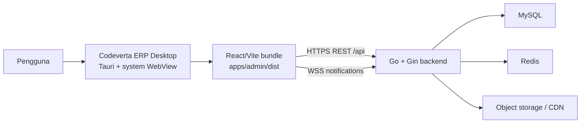

# Menjalankan dan Mendistribusikan Codeverta ERP Desktop (Tauri)

Dokumen ini menjelaskan arsitektur, instalasi prasyarat, konfigurasi, development, build, distribusi, keamanan, dan troubleshooting aplikasi desktop Codeverta ERP.

## 1. Ringkasan

Codeverta ERP Desktop menggunakan [Tauri 2](https://v2.tauri.app/) sebagai native shell untuk frontend React/Vite yang sudah ada di `apps/admin`.

Tauri tidak membawa browser Chromium sendiri. Aplikasi menggunakan web renderer bawaan sistem operasi:

- macOS: WebKit melalui WKWebView.
- Windows: Microsoft Edge WebView2.
- Linux: WebKitGTK.

Pendekatan ini menghasilkan aplikasi yang lebih kecil dan hemat memori dibandingkan desktop shell yang membundel browser lengkap. Build macOS ARM64 yang telah diverifikasi berukuran sekitar 35 MB.

### Yang dibundel

- Frontend React hasil produksi dari `apps/admin/dist`.
- Executable native Rust/Tauri.
- Icon dan metadata aplikasi.
- Content Security Policy (CSP) dan capability Tauri.

### Yang tidak dibundel

- Backend Go.
- MySQL, Redis, atau service infrastruktur lain.
- Data tenant.

Artinya, backend harus berjalan secara terpisah, baik di komputer lokal saat development maupun pada server seperti `https://erp-api.codeverta.com` untuk distribusi produksi.

## 2. Arsitektur runtime



Saat development, Tauri membuka Vite dev server di `http://127.0.0.1:5174`. Saat release, Tauri membaca file statis hasil build dari `apps/admin/dist` melalui protocol internal Tauri.

## 3. Lokasi file penting

| File/direktori | Fungsi |
| --- | --- |
| `apps/admin/src-tauri/tauri.conf.json` | Nama aplikasi, window, CSP, bundle target, dan integrasi Vite |
| `apps/admin/src-tauri/Cargo.toml` | Package Rust/Tauri dan optimasi release |
| `apps/admin/src-tauri/src/lib.rs` | Entry point library Tauri |
| `apps/admin/src-tauri/src/main.rs` | Entry point executable desktop |
| `apps/admin/src-tauri/capabilities/default.json` | Capability minimum untuk window utama |
| `apps/admin/src-tauri/icons/` | Icon macOS, Windows, Linux, dan varian platform |
| `apps/admin/vite.config.js` | Vite dev server pada port `5174` |
| `apps/admin/.env` | Konfigurasi API/CDN yang dimasukkan ke frontend |
| `apps/backend/middleware/cors.go` | Daftar origin web dan desktop yang boleh mengakses API |

## 4. Prasyarat umum

Semua platform membutuhkan:

- Git.
- Node.js dan Corepack.
- pnpm sesuai `packageManager` pada root `package.json` (`pnpm@11.3.0`).
- Rust toolchain dari `rustup`.
- Dependency native khusus sistem operasi.

Versi yang telah dipakai untuk memverifikasi project ini:

```text
Node.js 24.13.1
pnpm 11.3.0
rustc 1.94.0
cargo 1.94.0
Tauri CLI 2.11.4
```

Versi persis tersebut bukan kewajiban kecuali build mengalami incompatibility. Dependency JavaScript dikunci oleh `pnpm-lock.yaml`, sedangkan dependency Rust dikunci oleh `apps/admin/src-tauri/Cargo.lock`.

Aktifkan pnpm melalui Corepack:

```bash
corepack enable
corepack prepare pnpm@11.3.0 --activate
pnpm --version
```

Install Rust menggunakan petunjuk resmi [rustup](https://rustup.rs/), kemudian cek:

```bash
rustc --version
cargo --version
```

Panduan resmi prasyarat Tauri selalu tersedia di [Tauri prerequisites](https://v2.tauri.app/start/prerequisites/).

## 5. Prasyarat per sistem operasi

### 5.1 macOS

Untuk build desktop saja, install Xcode Command Line Tools:

```bash
xcode-select --install
```

Pastikan license dan toolchain sudah siap:

```bash
xcode-select -p
clang --version
```

Catatan:

- Dokumentasi Tauri saat ini menetapkan macOS Catalina 10.15 atau lebih baru untuk mesin development.
- `tauri.conf.json` mengatur `minimumSystemVersion` ke `10.13` untuk hasil aplikasi. Kompatibilitas pada versi macOS lama tetap harus diuji pada mesin nyata sebelum dirilis.
- Pembuatan DMG menggunakan komponen GUI macOS dan dapat gagal di terminal/headless runner. Bundle `.app` biasanya sudah berhasil dibuat sebelum tahap DMG.

### 5.2 Windows

Install komponen berikut:

1. Microsoft C++ Build Tools melalui Visual Studio Installer.
2. Pilih workload **Desktop development with C++**.
3. Microsoft Edge WebView2 Runtime.
4. Rust melalui `rustup-init.exe` atau `winget`.
5. Node.js, Corepack, dan pnpm.

Windows 10 versi modern dan Windows 11 umumnya sudah memiliki WebView2. Jika installer atau aplikasi gagal membuka window, install **WebView2 Evergreen Runtime** dari Microsoft.

Project ini menghasilkan installer NSIS, sehingga tidak membutuhkan tool MSI/WiX untuk command build standar project.

### 5.3 Linux (Debian/Ubuntu)

Install dependency Tauri/WebKitGTK:

```bash
sudo apt update
sudo apt install -y \
  libwebkit2gtk-4.1-dev \
  build-essential \
  curl \
  wget \
  file \
  libxdo-dev \
  libssl-dev \
  libayatana-appindicator3-dev \
  librsvg2-dev
```

Untuk Arch, Fedora, openSUSE, Alpine, dan distribusi lain, ikuti daftar package pada [prasyarat resmi Tauri](https://v2.tauri.app/start/prerequisites/#linux).

## 6. Setup project pertama kali

Jalankan dari root repository:

```bash
pnpm install

cp apps/backend/.env.example apps/backend/.env
cp apps/admin/.env.example apps/admin/.env
```

Isi secret backend dengan nilai yang aman. Minimal, `JWT_SECRET` harus memiliki setidaknya 64 karakter dan `DB_ENCRYPTION_KEY` harus sesuai persyaratan backend.

Contoh konfigurasi frontend untuk development lokal:

```dotenv
VITE_BASE_API_URL=http://localhost:8084
VITE_X_TENANT_ID=replace-with-development-tenant-uuid
VITE_COS_CDN_BASE_URL=http://localhost:8084
VITE_SENTRY_DSN=
```

Jangan menambahkan `/api` pada `VITE_BASE_API_URL`. Client Axios di frontend sudah menambahkan path `/api`.

### Konfigurasi produksi

Sebelum membuat installer yang akan dibagikan, ubah `apps/admin/.env` agar menunjuk ke service publik:

```dotenv
VITE_BASE_API_URL=https://erp-api.codeverta.com
VITE_X_TENANT_ID=replace-with-production-tenant-uuid
VITE_COS_CDN_BASE_URL=https://cdn.codeverta.com
VITE_SENTRY_DSN=
```

Penting: seluruh variable `VITE_*` dimasukkan ke JavaScript saat proses build. Variable tersebut bukan secret dan dapat dilihat oleh pengguna aplikasi. Jangan menaruh API key privat, password, token backend, atau signing credential di variable `VITE_*`.

Jika nilai `.env` diubah, build ulang aplikasi. Installer yang sudah dibuat tidak otomatis membaca perubahan `.env` dari server.

## 7. Menjalankan mode development

Gunakan dua terminal dari root repository.

Terminal pertama menjalankan backend:

```bash
pnpm dev:backend
```

Terminal kedua menjalankan Vite dan window Tauri:

```bash
pnpm dev:desktop
```

Alur command `pnpm dev:desktop`:

1. Root script memilih workspace `admin-page`.
2. Tauri menjalankan `beforeDevCommand`, yaitu `pnpm dev` di `apps/admin`.
3. Vite membuka `http://127.0.0.1:5174`.
4. Setelah dev server siap, Tauri membuka window native dan memuat URL tersebut.
5. Frontend mengakses backend dari `VITE_BASE_API_URL`.

Vite menggunakan `strictPort: true`. Jika port `5174` dipakai process lain, development akan berhenti agar Tauri tidak terhubung ke service yang salah.

### Menggunakan backend remote saat development

Atur `apps/admin/.env`:

```dotenv
VITE_BASE_API_URL=https://erp-api.codeverta.com
```

Lalu restart `pnpm dev:desktop`. Pastikan backend remote sudah memiliki perubahan CORS dari `apps/backend/middleware/cors.go`.

## 8. Build aplikasi

Build harus dijalankan dari root repository. Tauri pada dasarnya menargetkan sistem operasi host; cara paling stabil adalah membuat paket Windows di Windows, macOS di macOS, dan Linux di Linux.

### 8.1 Build binary tanpa installer

```bash
pnpm build:desktop
```

Command ini menjalankan `tauri build --no-bundle`. Gunakan untuk:

- Memastikan frontend dan Rust release dapat dikompilasi.
- Smoke test sebelum packaging.
- CI yang hanya membutuhkan executable.

Output berada di:

```text
apps/admin/src-tauri/target/release/
```

Contoh nama executable:

- macOS/Linux: `codeverta-erp`
- Windows: `codeverta-erp.exe`

### 8.2 Build macOS

Jalankan pada macOS:

```bash
pnpm build:desktop:macos
```

Target yang dibuat:

- Application bundle `.app`.
- Installer `.dmg`.

Output:

```text
apps/admin/src-tauri/target/release/bundle/macos/
apps/admin/src-tauri/target/release/bundle/dmg/
```

Untuk membuat `.app` saja, terutama pada runner headless:

```bash
pnpm --filter admin-page tauri build --bundles app
```

### 8.3 Build Windows

Jalankan pada Windows PowerShell:

```powershell
pnpm build:desktop:windows
```

Target yang dibuat adalah installer NSIS `.exe`. Output berada di:

```text
apps/admin/src-tauri/target/release/bundle/nsis/
```

### 8.4 Build Linux

Jalankan pada mesin Linux:

```bash
pnpm build:desktop:linux
```

Target yang dibuat:

- Paket Debian `.deb`.
- Portable AppImage.

Output:

```text
apps/admin/src-tauri/target/release/bundle/deb/
apps/admin/src-tauri/target/release/bundle/appimage/
```

Nama file output mengandung versi dan arsitektur. Gunakan `find` jika nama persisnya berbeda:

```bash
find apps/admin/src-tauri/target/release/bundle -maxdepth 2 -type f
```

## 9. Menjalankan hasil build

### macOS

Buka:

```text
apps/admin/src-tauri/target/release/bundle/macos/Codeverta ERP.app
```

Atau melalui terminal:

```bash
open "apps/admin/src-tauri/target/release/bundle/macos/Codeverta ERP.app"
```

Build unsigned untuk development mungkin diblokir Gatekeeper. Untuk distribusi publik, lakukan signing dan notarization; jangan mengandalkan pengguna untuk menonaktifkan Gatekeeper.

### Windows

Jalankan installer dari folder `bundle/nsis`, selesaikan instalasi, lalu buka **Codeverta ERP** melalui Start Menu.

### Linux

Install DEB:

```bash
sudo apt install ./apps/admin/src-tauri/target/release/bundle/deb/*.deb
```

Atau jalankan AppImage:

```bash
chmod +x apps/admin/src-tauri/target/release/bundle/appimage/*.AppImage
./apps/admin/src-tauri/target/release/bundle/appimage/*.AppImage
```

## 10. CORS dan koneksi backend

Frontend desktop memiliki origin berbeda dari website biasa. Backend saat ini mengizinkan:

```text
tauri://localhost
http://tauri.localhost
https://tauri.localhost
```

Origin tersebut menangani perbedaan protocol WebView antarplatform. Aturannya berada di `apps/backend/middleware/cors.go` dan menggunakan exact match, bukan wildcard.

Jika frontend desktop memakai backend produksi, perubahan CORS ini harus ikut dibuild dan dideploy ke backend produksi. Mengubah aplikasi desktop saja tidak cukup.

WebSocket notification juga harus tersedia melalui `ws://` untuk lokal atau `wss://` untuk produksi. Reverse proxy produksi harus meneruskan upgrade WebSocket dengan benar.

## 11. Konfigurasi keamanan

### Content Security Policy

CSP pada `tauri.conf.json` membatasi resource yang boleh digunakan aplikasi:

- API lokal dan WebSocket lokal untuk development.
- HTTPS/WSS subdomain `codeverta.com` untuk produksi.
- Sentry jika dikonfigurasi.
- Gambar/media dari HTTP(S), `data:`, dan `blob:` sesuai kebutuhan ERP.
- `object-src 'none'` untuk memblokir plugin/object lama.
- `base-uri 'self'` untuk mencegah perubahan base URL dari konten luar.

Jika menambahkan domain API, CDN, analytics, iframe, atau media baru, update CSP secara spesifik. Hindari wildcard global seperti `connect-src *`.

### Capability Tauri

`capabilities/default.json` hanya memberikan `core:default` kepada window `main`. Belum ada plugin filesystem, shell, updater, atau akses native sensitif. Jika plugin baru ditambahkan, berikan permission minimum yang benar-benar diperlukan.

### Penyimpanan autentikasi

Frontend saat ini menggunakan storage WebView yang sama seperti aplikasi web. Data storage desktop terisolasi dari browser reguler, tetapi tetap berada pada profile aplikasi milik user OS. Jangan log access token, refresh token, atau data sensitif ke console.

## 12. Versi aplikasi

Sebelum rilis, sinkronkan versi pada:

1. `apps/admin/package.json` → `version`.
2. `apps/admin/src-tauri/tauri.conf.json` → `version`.
3. `apps/admin/src-tauri/Cargo.toml` → `package.version`.

Format yang disarankan mengikuti semantic versioning, misalnya `2.1.1`.

Setelah mengubah versi Rust/package, jalankan build agar `Cargo.lock` dan output bundle diperbarui.

## 13. Signing dan distribusi publik

Build tanpa signature cukup untuk development internal, tetapi bukan rilis publik yang ideal. Code signing membantu OS memverifikasi publisher dan integritas file.

### macOS

Distribusi di luar App Store membutuhkan certificate **Developer ID Application**, code signing, dan notarization Apple. Credential dapat diberikan melalui environment variable/CI; jangan commit certificate atau password ke repository.

Referensi resmi:

- [macOS code signing dan notarization](https://v2.tauri.app/distribute/sign/macos/)
- [Distribusi DMG](https://v2.tauri.app/distribute/dmg/)

### Windows

Sign installer untuk mengurangi warning Microsoft Defender SmartScreen dan membuktikan identitas publisher. Gunakan certificate dari penyedia yang dipercaya dan simpan credential pada secret store CI.

Referensi resmi:

- [Windows code signing](https://v2.tauri.app/distribute/sign/windows/)
- [Windows installer](https://v2.tauri.app/distribute/windows-installer/)

### Linux

Signing tidak selalu diwajibkan oleh distribusi Linux, tetapi package repository dan artifact release sebaiknya dilengkapi checksum atau signature yang dapat diverifikasi.

Referensi: [Linux code signing](https://v2.tauri.app/distribute/sign/linux/).

## 14. Checklist rilis

Sebelum membuat artifact final:

- [ ] Working tree hanya berisi perubahan yang memang akan dirilis.
- [ ] Versi pada package, Tauri config, dan Cargo package sudah sama.
- [ ] `apps/admin/.env` menunjuk ke API/CDN produksi yang benar.
- [ ] `VITE_X_TENANT_ID` menggunakan tenant produksi yang benar.
- [ ] Tidak ada secret backend di variable `VITE_*`.
- [ ] Backend produksi telah menerima origin CORS Tauri.
- [ ] Frontend production build berhasil.
- [ ] Test backend CORS berhasil.
- [ ] Binary release berhasil.
- [ ] Installer dibuat pada OS dan arsitektur target.
- [ ] Installer sudah ditandatangani jika didistribusikan ke pengguna umum.
- [ ] macOS artifact sudah dinotarize.
- [ ] Login, logout, refresh token, dan pergantian tenant diuji.
- [ ] REST API dan notification WebSocket diuji.
- [ ] Download, upload, print, dan link eksternal diuji pada setiap OS.
- [ ] SHA-256 artifact dicatat dan dipublikasikan melalui channel resmi.

Command verifikasi dasar:

```bash
pnpm --filter admin-page build
cargo check --manifest-path apps/admin/src-tauri/Cargo.toml

cd apps/backend
JWT_SECRET="$(openssl rand -hex 32)" go test ./middleware -run TestCORSMiddleware -count=1
```

Contoh membuat checksum artifact:

```bash
shasum -a 256 path/to/artifact
```

Pada Linux gunakan `sha256sum` jika `shasum` tidak tersedia.

## 15. Troubleshooting

### Port 5174 sudah digunakan

Gejala:

```text
Port 5174 is already in use
```

Cari process yang memakai port:

```bash
lsof -nP -iTCP:5174 -sTCP:LISTEN
```

Hentikan process tersebut atau ubah `server.port` di `apps/admin/vite.config.js` dan `build.devUrl` di `tauri.conf.json` secara bersamaan.

### Window terbuka tetapi API gagal

Periksa:

1. Backend sedang berjalan dan dapat diakses dari mesin desktop.
2. `VITE_BASE_API_URL` benar dan tidak diakhiri `/api`.
3. Aplikasi sudah dibuild ulang setelah `.env` berubah.
4. Backend mengizinkan origin Tauri.
5. HTTPS certificate backend valid.
6. CSP mengizinkan domain tujuan.

Jika build memakai `http://localhost:8084`, aplikasi akan mencari backend pada komputer pengguna, bukan pada server developer.

### Error CORS saat login/request

Deploy `apps/backend/middleware/cors.go` terbaru dan cek response preflight:

```bash
curl -i -X OPTIONS https://erp-api.codeverta.com/api/auth/login \
  -H 'Origin: tauri://localhost' \
  -H 'Access-Control-Request-Method: POST'
```

Response harus memiliki `Access-Control-Allow-Origin` yang sesuai. Jangan mengubah konfigurasi menjadi wildcard jika `AllowCredentials` aktif.

### macOS DMG gagal tetapi `.app` tersedia

Hal ini dapat terjadi pada SSH/headless runner karena packaging DMG menggunakan tool macOS yang membutuhkan sesi GUI. Cek folder:

```text
apps/admin/src-tauri/target/release/bundle/macos/
```

Build `.app` saja:

```bash
pnpm --filter admin-page tauri build --bundles app
```

Kemudian buat DMG dari sesi desktop macOS atau pipeline yang mendukungnya.

### macOS menolak aplikasi unsigned

Untuk distribusi publik, sign dan notarize aplikasi. Build ad-hoc/internal dapat dibuka melalui pengaturan Privacy & Security, tetapi itu bukan pengganti signing produksi.

### Windows hanya menampilkan window kosong

- Pastikan WebView2 Runtime terpasang.
- Cek apakah CSP memblokir API/resource.
- Jalankan mode development dari PowerShell untuk melihat log Tauri dan Vite.
- Pastikan antivirus tidak mengarantina executable unsigned.

### `TypeError: Attempted to assign to readonly property` dari Axios

Pastikan `app.security.freezePrototype` di `apps/admin/src-tauri/tauri.conf.json` bernilai `false`. Axios melakukan normalisasi property descriptor ketika module diinisialisasi dan tidak kompatibel dengan prototype freezing Tauri pada WKWebView. Project tetap menggunakan CSP ketat dan capability minimum sebagai lapisan keamanan utama.

Setelah mengubah konfigurasi, hentikan process Tauri yang lama lalu jalankan ulang:

```bash
pnpm dev:desktop
```

### Linux gagal menemukan WebKitGTK

Install package development `libwebkit2gtk-4.1-dev` beserta dependency Tauri sesuai distribusi. Perhatikan angka `4.1`; package `4.0` tidak selalu kompatibel dengan Tauri versi saat ini.

### Build Rust sangat lama

Build release memakai:

- Link-time optimization (`lto = true`).
- Satu codegen unit.
- Optimasi ukuran (`opt-level = "s"`).
- Symbol stripping.

Build pertama dapat memakan beberapa menit karena seluruh dependency Rust dikompilasi. Build berikutnya menggunakan cache di `src-tauri/target` dan biasanya lebih cepat. Jangan menghapus folder tersebut kecuali sedang mengatasi cache build yang rusak.

### Frontend memberi warning chunk besar

Warning ukuran chunk Vite tidak menggagalkan build. Aplikasi tetap dapat dijalankan, tetapi startup dapat ditingkatkan kemudian dengan lazy route/dynamic import pada modul besar.

## 16. Batasan implementasi saat ini

- Backend belum dibundel sebagai sidecar; koneksi network tetap diperlukan untuk penggunaan produksi.
- Auto updater belum dipasang.
- System tray dan autostart belum dipasang.
- Deep link protocol khusus belum dikonfigurasi.
- Signing/notarization belum disimpan dalam konfigurasi repository karena membutuhkan credential organisasi.
- Target mobile Android/iOS tidak termasuk scope aplikasi desktop ini meskipun Tauri mendukung mobile.

Penambahan fitur native sebaiknya dilakukan berdasarkan kebutuhan nyata agar permission, ukuran aplikasi, dan surface keamanan tetap minimum.

## 17. Referensi

- [Tauri 2 documentation](https://v2.tauri.app/)
- [Tauri prerequisites](https://v2.tauri.app/start/prerequisites/)
- [Tauri distribution guide](https://v2.tauri.app/distribute/)
- [Tauri configuration reference](https://v2.tauri.app/reference/config/)
- [Tauri security](https://v2.tauri.app/security/)
